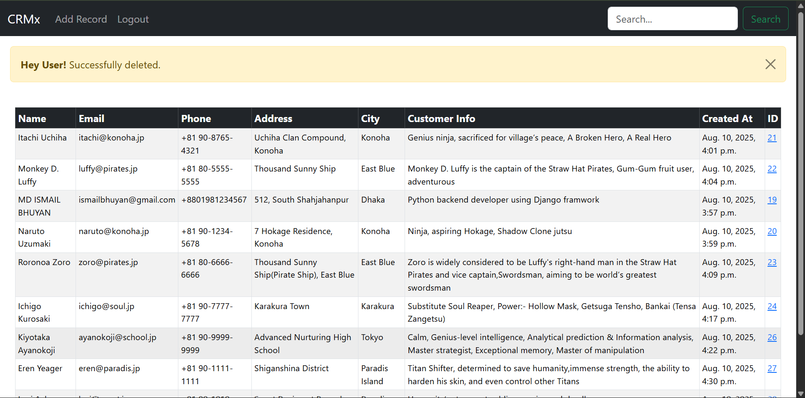

# 📌 CRM Project

  
  
  
  

*Description*

A **Django-based Customer Relationship Management (CRM) Project** is a Django-based Customer Relationship Management application that lets users manage customer data efficiently.

It supports **adding**, **updating**, **deleting**, and **searching** customer records, along with **profile images** and *detailed info*.

The app includes *authentication* (**login**, **logout**, **registration**) and an admin panel for easy management.

---

## 🚀 Features

- ✅ User Authentication – Login, Logout, Registration  
- ✅ Customer Management – Add, Update, Delete, Search customers 
- ✅ Profile Images – Store and display customer profile photos
- ✅ Media Uploads – Images stored in /Uploads/pictures/  
- ✅ Search Functionality – By first name, last name, or email  
- ✅ Admin Panel – Manage records through Django admin  
- ✅ Database- PostgreSQL Database Support
- ✅ Dynamic URLs – View customer details by ID
- ✅ Local Development – Runs on http://127.0.0.1:8000

---

## 📂 Project Structure

```

CRM_Project/
│
├── crmapp/
│   ├── migrations/
│   ├── static/
│   │   └── default/            # Default profile images
│   ├── templates/              # HTML templates
│   ├── __init__.py
│   ├── admin.py
│   ├── apps.py
│   ├── models.py
│   ├── tests.py
│   ├── urls.py
│   └── views.py
│
├── crmproject/
│   ├── __init__.py
│   ├── asgi.py
│   ├── settings.py
│   ├── urls.py
│   └── wsgi.py
│
├── Uploads/                    # Uploaded media files
│   └── pictures/               # Profile pictures
│
├── db.sqlite3                   # (If using SQLite)
├── manage.py
└── requirements.txt


```


---
## Installation

**1. Clone the repository**
```
git clone https://github.com//ismailCrafts//CRM_Project.git
cd CRM_Project
```

**2. Create and activate virtual environment**
```
python -m venv venv
venv\Scripts\activate  # On Windows
source venv/bin/activate  # On Mac/Linux

```

**3. Install dependencies**
```
pip install -r requirements.txt

```

**4. PostgreSQL Setup**

Make sure PostgreSQL is installed and running.
Create a database and update ```crmproject/settings.py```:


```
DATABASES = {
    'default': {
        'ENGINE': 'django.db.backends.postgresql',
        'NAME': 'crm_database',
        'USER': 'postgres',
        'PASSWORD': '1234',
        'HOST': 'localhost',
        'PORT': '5432',
    }
}

```

**5. Run migrations**
```
python manage.py makemigrations
python manage.py migrate

```

**6. Create a superuser**
```
python manage.py createsuperuser

```

**7. Run the development server**
```
python manage.py runserver

```
*Visit: http://127.0.0.1:8000*

---

## Media & Static Files

* Static Files: Located in ```crmapp/static/```

* Media Files: Uploaded images stored in ```Uploads/pictures/```

* Config in ```settings.py```:

```
STATIC_URL = 'static/'
STATICFILES_DIRS = [os.path.join(BASE_DIR, 'static')]

MEDIA_URL = '/Uploads/'
MEDIA_ROOT = os.path.join(BASE_DIR, 'Uploads')
```

---

## Usage

1. Register or log in.

2. Add new customers with details and profile images.

3. View all customers in a table.

4. Click the ID link to see detailed customer info.

5. Edit or delete records as needed.

6. Search customers using the search bar.


---


## Screenshots

1. CRM login Page
   

2. CRM Registration Page
    

3. CRM Home Page After Login or Registration
   

4. CRM Home Page Without Any Messages 
   

5. CRM Individual Page
   

6. CRM Individual Page
   

7.  CRM Individual Page
   

8. CRM Individual Page
   

9.  CRM Individual Page
   

10. CRM Search Functionality
    

11. CRM Search Functionality
    

12. CRM Add Customer Record
    

13. CRM Update Customer Record
    

14. CRM Delete Customer Record
    


---

## Contributing

We welcome contributions from everyone! Whether it's fixing bugs, improving documentation, or adding new features, your help is appreciated.

---

# MIT License

Copyright (c) 2025 MD ISMAIL BHUYAN

Permission is hereby granted, free of charge, to any person obtaining a copy
of this software and associated documentation files (the "Software"), to deal
in the Software without restriction, including without limitation the rights
to use, copy, modify, merge, publish, distribute, sublicense, and/or sell
copies of the Software, and to permit persons to whom the Software is
furnished to do so, subject to the following conditions:

The above copyright notice and this permission notice shall be included in all
copies or substantial portions of the Software.

THE SOFTWARE IS PROVIDED "AS IS", WITHOUT WARRANTY OF ANY KIND, EXPRESS OR
IMPLIED, INCLUDING BUT NOT LIMITED TO THE WARRANTIES OF MERCHANTABILITY,
FITNESS FOR A PARTICULAR PURPOSE AND NONINFRINGEMENT. IN NO EVENT SHALL THE
AUTHORS OR COPYRIGHT HOLDERS BE LIABLE FOR ANY CLAIM, DAMAGES OR OTHER
LIABILITY, WHETHER IN AN ACTION OF CONTRACT, TORT OR OTHERWISE, ARISING FROM,
OUT OF OR IN CONNECTION WITH THE SOFTWARE OR THE USE OR OTHER DEALINGS IN THE
SOFTWARE.


